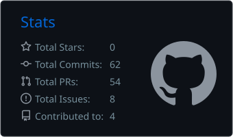
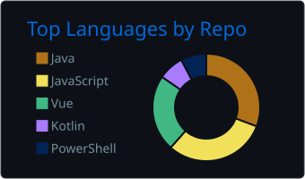

# Climent Fernández

## Stack Principal

## Actividad en Vivo y Métricas

<picture>
  <source media="(prefers-color-scheme: dark)" srcset="https://raw.githubusercontent.com/a23cliferand/a23cliferand/output/github-contribution-grid-snake-dark.svg" />
  <source media="(prefers-color-scheme: light)" srcset="https://raw.githubusercontent.com/a23cliferand/a23cliferand/output/github-contribution-grid-snake.svg" />
  
</picture>

## Tarjetas de Desempeño

